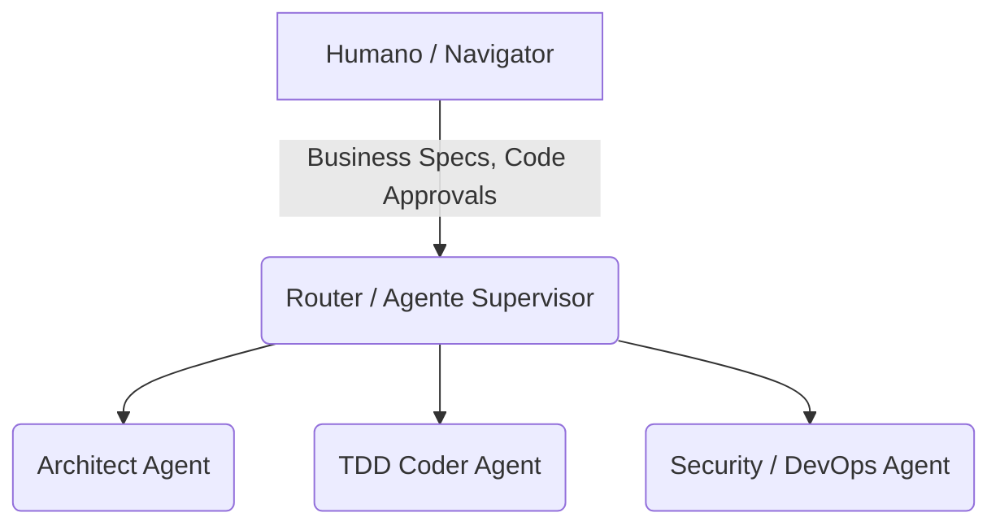

# 🗺️ Orquestração Multiagente (A Topologia do Esquadrão)

> **Módulo:** Engenharia Multiagentes AI-XP  
> **Base Teórica:** XP com Agentes de IA — Seção 3  
> **Propósito:** Padronizar qual framework instanciar para o roteamento e a segregação estrita de obrigações de agentes sistêmicos (Context Engineering).

---

## 1. O Problema Epistêmico de um "Mega-Agente"

Delegar a um único LLM toda a cadeia de execução arruína a integridade sistêmica por _saturação e poluição de tokens_. A solução é um paralelismo estruturado por "Expertise Roles".

---

## 2. Comparativo de Frameworks Corporativos

| Framework                 | Padrão                                                            | Vantagem Ponto Forte                                                             | Desvantagem de Retenção                                         |
| ------------------------- | ----------------------------------------------------------------- | -------------------------------------------------------------------------------- | --------------------------------------------------------------- |
| **LangGraph (LangChain)** | Topologia de Grafos de Estado. Cycles & Branching. Machine-state. | Controle Cíclico Inigualável, alta robustez, Time Travel e "Memory-Checkpoints". | Mais complexo de debugar código boilerplate.                    |
| **CrewAI**                | Hierarquia Organizacional de Squads (Papéis, Metas, Tarefas).     | Facilidade brutal de criar Agentes Cooperativos modulares (Delegation).          | Abstrai os limites, podendo vazar _token memory_ se mal tunado. |
| **AutoGen (Microsoft)**   | Foco de Diálogos Peer-to-Peer. Arbitragem.                        | Dinâmicas Socráticas onde codificadores refutam as próprias teses.               | Falta previsibilidade da rede de chamadas (Redes caóticas).     |

**Adoção StoryForge:** _CrewAI_ como orquestração de Agentes para funções locais (geração) em virtude de abstração de equipe; mas _LangGraph_ como matriz diretiva de infraestrutura e pipelines analíticos de CI/CD em processos ciclomáticos.

---

## 3. A Topologia de Esquadrão (A Pirâmide Agêntica)

1. **Agente Supervisor (Router):** Determina com LLMs mais pesados para onde direcionar a semântica do prompt, divide sub-tarefas e sumariza histórico para evitar estouro de buffers (Memory Manager).
2. **Agente Arquiteto (Architect):** Responsável único pelo domínio e modelo mental de Clean Architecture (Não lida com dependências web, cria pseudocódigos).
3. **Agente TDD Coder:** Implementador isolado focado no ciclo Red-Green; recebe o menor e mais puro bloco de input.
4. **Agente Revisor (DevSecOps):** Varre a esteira SAST (SonarQube) mitigando SQL Injection, chaves hardcoded e Acoplamento implícito e re-chama o Coder se violado.

